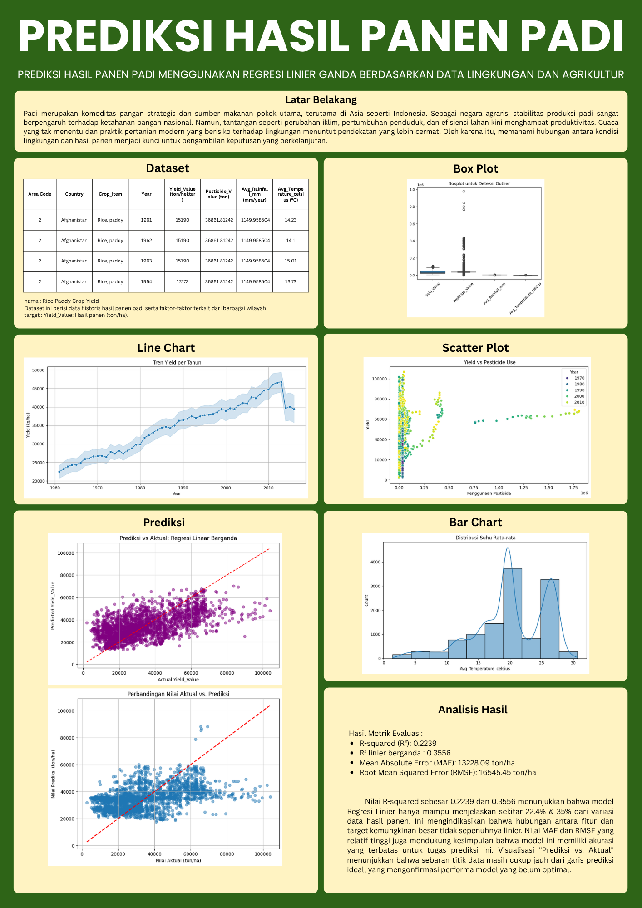

# Crop Yield Analysis

---

## Dataset

---

Dataset yang digunakan dalam proyek ini berasal dari Kaggle:

**Crop Yield Prediction Dataset**  
📎 [https://www.kaggle.com/datasets/patelris/crop-yield-prediction-dataset/data](https://www.kaggle.com/datasets/patelris/crop-yield-prediction-dataset/data)  
📌 Oleh: [Rishi Patel](https://www.kaggle.com/patelris)

Dataset ini berisi informasi hasil panen tanaman (termasuk padi) dari berbagai negara sejak tahun 1961, beserta data lingkungan yang relevan, seperti:

- `Country`: Nama negara
- `Crop_Item`: Jenis tanaman (fokus: Rice, paddy)
- `Year`: Tahun pencatatan
- `Yield_Value`: Hasil panen (ton/hektar)
- `Pesticide_Value`: Penggunaan pestisida (ton)
- `Avg_Rainfall_mm`: Rata-rata curah hujan (mm)
- `Avg_Temperature_celsius`: Rata-rata suhu tahunan (°C)

Data ini digunakan untuk keperluan eksplorasi, analisis korelasi, dan pembangunan model regresi linier sederhana maupun berganda untuk memprediksi hasil panen padi.

---

## Dashboard
📎 [https://dashboard-prediksi-panen.streamlit.app/](https://dashboard-prediksi-panen.streamlit.app/)

---

## Poster

